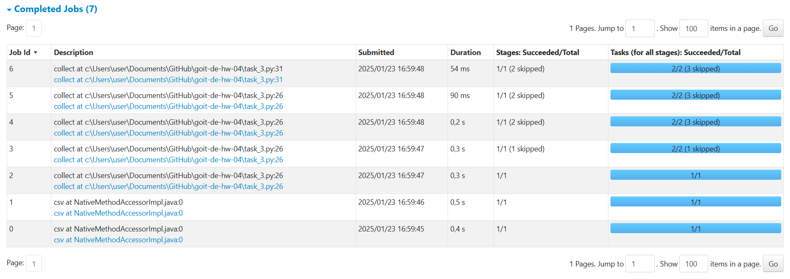

# goit-de-hw-04

Короткий опис виконання завдання
У цьому завданні ми працювали з PySpark для обробки даних з CSV-файлу

Основні етапи виконання завдання включали:

- Створення сесії Spark: Ініціалізували сесію Spark з налаштуваннями для локального виконання.

- Завантаження датасету: Використали метод spark.read.csv для завантаження даних з файлу nuek-vuh3.csv, з параметрами для автоматичного визначення заголовків та типів даних.

- Репартіціювання даних: Змінили кількість партицій DataFrame на 2 для оптимізації подальшої обробки.

Обробка даних:

- Відфільтрували записи з final_priority < 3.
- Вибрали лише стовпці unit_id та final_priority.
- Групували дані за unit_id та підрахували кількість записів для кожного unit_id.
- Додавання проміжних дій:

У першій частині завдання ми виконали collect(), що призвело до створення 8 Jobs, оскільки кожна дія викликала обчислення даних.

У другій частині ми додали фільтрацію за count > 2 після collect(), що також вплинуло на кількість Jobs.

- Використання кешування:

У третій частині завдання ми застосували метод cache() до проміжного результату, що дозволило зберегти дані в пам'яті. Це зменшило кількість Jobs до 7, оскільки повторні обчислення не виконувалися, а дані були доступні з кешу.

- Завершення роботи: Після виконання всіх дій, ми закрили сесію Spark та звільнили пам'ять від кешованого DataFrame.

### Висновки

Додавання проміжних дій, таких як collect(), збільшує кількість Jobs, оскільки кожна дія викликає обчислення даних.
Використання cache() дозволяє зменшити кількість Jobs, оскільки дані зберігаються в пам'яті, що запобігає повторним обчисленням.

Далі скриншоти виконаних завдань:

### Частина 1

### Частина 2

### Частина 3

